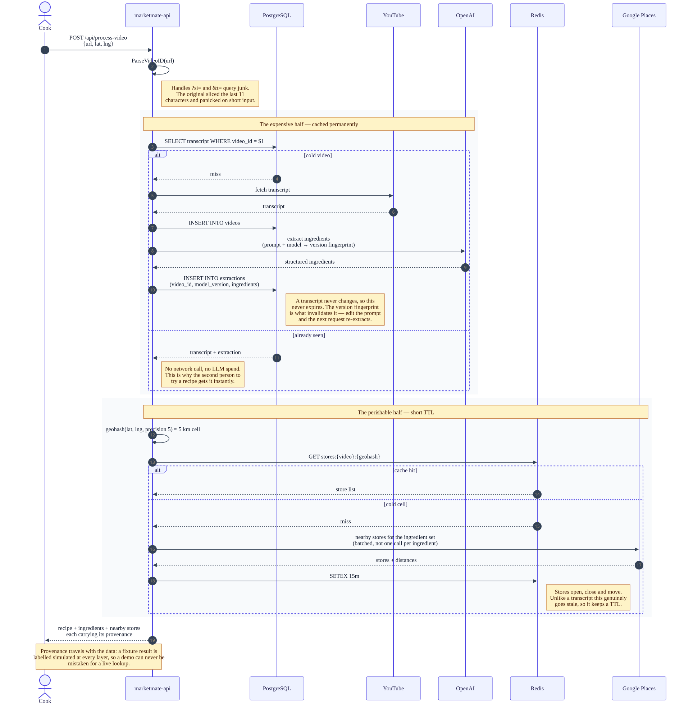

# MarketMate

[](https://github.com/udaykishore-resu/market-mate/actions/workflows/ci.yml)
[](https://github.com/udaykishore-resu/market-mate/actions/workflows/release.yml)


Paste a YouTube cooking video link and MarketMate pulls out the ingredient list,
then shows nearby stores where you can buy them.

```bash
git clone https://github.com/udaykishore-resu/market-mate
cd market-mate
make demo
```

Open http://localhost:5173. **No API keys, no signup, no billing account.**

## Architecture

[](docs/diagrams/architecture.svg)

<sub>Download: [SVG](docs/diagrams/architecture.svg) · [PNG](docs/diagrams/architecture.png) · [Mermaid source](docs/diagrams/architecture.mmd)</sub>

Every external stage sits behind an interface with a live and a fixture
implementation, chosen at startup by whether that stage's API key is present.
Postgres, Redis and Elasticsearch are each optional in the same way: unset the
variable and the previous behaviour takes over.

| Unset               | Falls back to                                  |
|---------------------|------------------------------------------------|
| `MM_POSTGRES_DSN`   | no durable transcript or extraction cache       |
| `MM_REDIS_ADDR`     | the in-process `go-cache`                       |
| `MM_ELASTIC_URL`    | SQL `ILIKE` scan over cached recipes            |
| `OPENAI_API_KEY` &c | fixture providers, results labelled `simulated` |

## Request walkthrough

[](docs/diagrams/sequence-recipe-to-stores.svg)

<sub>Download: [SVG](docs/diagrams/sequence-recipe-to-stores.svg) · [PNG](docs/diagrams/sequence-recipe-to-stores.png) · [Mermaid source](docs/diagrams/sequence-recipe-to-stores.mmd)</sub>

## What gets cached, and for how long

[](docs/diagrams/flow-cache.svg)

<sub>Download: [SVG](docs/diagrams/flow-cache.svg) · [PNG](docs/diagrams/flow-cache.png) · [Mermaid source](docs/diagrams/flow-cache.mmd)</sub>

The single most valuable change in this iteration. A request has two halves with
opposite lifetimes, and the original applied one 15-minute TTL to both:

- **A transcript and its extracted ingredients never change.** Throwing them away
  every 15 minutes meant re-paying for a transcript fetch and an LLM call on the
  next request for the same video — the dominant cost per request, and entirely
  avoidable. They are now permanent rows in Postgres, invalidated only by a
  change to the extraction prompt or model, which is captured as a fingerprint
  in `model_version`.
- **Nearby stores genuinely go stale.** Those keep a TTL, in Redis so the cache
  survives a restart and is shared across replicas, keyed on video plus a
  precision-5 geohash (~5 km) rather than a rounded latitude and longitude,
  because a rounding boundary puts two people a hundred metres apart in
  different cells.

## How it works

The backend resolves the video ID from whatever link you paste, fetches the
video's details from the YouTube Data API, sends the description to OpenAI to
extract a structured ingredient list, geolocates you from your IP, and looks up
nearby grocery stores via the Google Places API.

What gets cached depends on whether it can change. A video's transcript and the
ingredients extracted from it cannot, so with `MM_POSTGRES_DSN` set they are
stored permanently and never re-fetched or re-extracted. Store results can, so
they keep a 15 minute TTL — in Redis when `MM_REDIS_ADDR` is set, in process
otherwise.

Each of those three external stages sits behind an interface with two
implementations: the live API client, and a fixture that returns realistic data.
Which one runs is decided per stage at startup by whether that stage's API key
is present. That is why the quick start above works with an empty environment —
and why the whole pipeline is testable without a network.

## Demo mode

| Keys present | Behaviour |
|---|---|
| none | Every stage uses fixtures. Fully working demo. |
| some | Those stages go live; the rest stay simulated. |
| all | Fully live. |

Simulated results are never disguised as real ones. The response carries a
`simulated` block naming which stages were fixtures, the UI shows a banner, and
`GET /api/health` reports the mode. `DEMO_MODE=true` forces fixtures even when
keys are present, which is useful for screenshots and deterministic tests.

## API

### `POST /api/process-video`

```json
{ "url": "https://youtu.be/dQw4w9WgXcQ?si=Ab1Cd2Ef3Gh4" }
```

Accepts every YouTube link form: `watch?v=`, `youtu.be/`, `/shorts/`, `/embed/`,
`/live/`, `/v/`, a bare 11-character ID, and any of those carrying `?si=`, `&t=`,
or `&list=` parameters.

```json
{
  "ingredients": [{ "name": "Spaghetti", "quantity": "400 g" }],
  "stores": [{
    "name": "Whole Foods Market",
    "address": "100 Market Street",
    "distance": "0.5 km",
    "mapUrl": "https://www.google.com/maps/search/?api=1&query=37.778,-122.416"
  }],
  "video": { "id": "...", "title": "...", "channelTitle": "...", "thumbnailUrl": "..." },
  "location": { "latitude": 37.77, "longitude": -122.42, "label": "San Francisco, CA", "estimated": false },
  "simulated": { "video": false, "ingredients": false, "stores": false, "any": false },
  "cached": false,
  "notice": ""
}
```

Errors return `{"error": "...", "stage": "url|video|ingredients|stores"}` with an
appropriate status: 400 for a bad URL, 429 (with `Retry-After`) when rate
limited, 502 when an upstream provider fails.

### `GET /api/recipes/search?q=&ingredient=&limit=`

Searches stored recipes by title, channel or ingredient. Elasticsearch when
`MM_ELASTIC_URL` is set, a substring scan over Postgres otherwise; the response
names which one answered.

### `POST /graphql`, `GET /graphiql`

`recipe`, `searchRecipes`, `stores` and `health`. Every type that can be fixture
data carries a `provenance` field. GraphiQL needs `MM_GRAPHIQL=true`.

### `GET /api/health`

Reports status, whether each provider is `live` or `simulated`, per-dependency
state with latency, and cache stats. `degraded` with a 200 when an optional
dependency is down — the service still answers — and 503 only while draining.

## Configuration

Everything is optional — see `market-mate-be/.env.example`.

| Variable | Default | Purpose |
|---|---|---|
| `YOUTUBE_API_KEY` | — | Live video metadata |
| `OPENAI_API_KEY` | — | Live ingredient extraction |
| `MAPS_API_KEY` | — | Live store search |
| `PORT` | `8080` | Backend listen port |
| `ALLOWED_ORIGINS` | `localhost:5173,localhost:4173` | CORS allow-list |
| `DEMO_MODE` | `false` | Force fixtures even with keys |
| `MM_POSTGRES_DSN` | — | Permanent transcript and extraction cache |
| `MM_REDIS_ADDR` | — | Shared store cache; in-process cache when unset |
| `MM_ELASTIC_URL` | — | Recipe search; Postgres substring scan when unset |
| `MM_GRAPHIQL` | `false` | Serve the GraphiQL explorer |

Frontend: `VITE_API_BASE_URL` (default empty = same origin; the dev and preview
servers proxy `/api` to the backend).

## Development

```bash
make demo      # both services, no keys needed
make dev-be    # backend only  → :8080
make dev-fe    # frontend only → :5173
make test      # backend tests with race detector and coverage
make lint      # go vet + tsc --noEmit
make build     # static binary + production bundle
```

Tests need no keys and make no network calls; they run the real handler against
the fixture providers.

## Deployment

```bash
docker compose up --build     # → http://localhost:8081
```

The backend builds to a static CGO-free binary on a distroless base and probes
its own health endpoint via `market-mate -health` (distroless has no shell). The
frontend builds to static files served by nginx, which proxies `/api` to the
backend so the browser stays same-origin and CORS never applies in production.

For a platform deploy, the backend is a single binary reading `PORT` and the
frontend is a static `dist/` directory — both fit Render, Fly.io, Railway, or
Cloud Run without modification.

## Project structure

```
market-mate-be/            Go 1.21 + Gin
  cmd/                     entrypoint, provider selection, graceful shutdown
  handlers/                HTTP handlers + tests
  services/                providers (live + fixture), URL parsing, cache, geohash, location
  storage/                 Postgres store + embedded migrations
  search/                  Elasticsearch client + Postgres fallback
  gql/                     GraphQL schema and resolvers
  health/                  dependency probes, shared by REST and GraphQL
  middleware/              request logging, per-IP rate limiting
  models/                  API and record types
market-mate-fe/            React 18 + Vite + TypeScript + shadcn-ui + Tailwind
specs/                     spec-driven development docs
```

## Notes on this iteration

The store lookup no longer uses a fixed San Francisco coordinate. It geolocates
from the client IP with a bounded timeout, skips the lookup entirely for private
and loopback addresses, and marks the result `estimated` when it falls back. The
response cache and the location service were both already constructed and
injected into the handler but never called; both are now live.

The URL parser was rewritten. The previous implementation took the last 11
characters of the input string, which returned garbage for any link carrying
query parameters — including the `?si=` that YouTube's share button appends by
default — and panicked outright on input shorter than 11 characters. It is now a
real parser with table-driven tests and a fuzz target.

## Repository topics

Topics live in GitHub metadata rather than in the tree, so the intended set is
kept in [`scripts/set-topics.sh`](scripts/set-topics.sh) where it is reviewable:

```bash
./scripts/set-topics.sh --print    # show the list
./scripts/set-topics.sh            # apply it (needs the gh CLI, authenticated)
```
